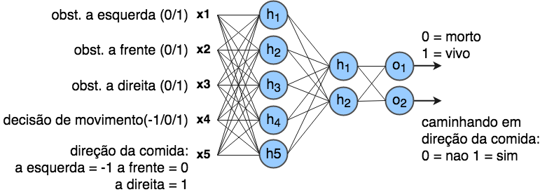

# Redes Neurais aplicado a jogos digitais
Este é o material da oficina de redes neurais aplicado a jogos digitais. Em especial, este curso é dedicado a pessoas curiosas que querem iniciar carreira na área de aprendizagem de máquina. Se você já tem _expertise_ na área, sinto lhe informar que este material não apresenta métodos avançados, apenas implementação de conceitos básicos em projetos divertidos  =). Se você é professor, fique a vontade para usar este material em suas aulas, mas cite a referência ;)

Vale ressaltar que o ideal é obter este material após assistir minha aula sobre fundamentos de aprendizagem de máquina e redes neurais. De qualquer forma, meus _slides_ estão na pasta "slide" que esta na raiz deste repositório.

### Dependências
Este material foi desenvolvido com a linguagem Python versão 3.6.5. Para executar os projetos é necessário instalar as seguintes dependências:

  * PyGame versão 1.9.4
  * TensorFlow versão 1.8
  * Numpy versão 1.14

Você pode testar outras versões dos pacotes, mas caso ocorra algum erro, use as versões listadas acima.

## Projeto 1 - NN Snake

O primeiro projeto da oficina é um _snake_ (vulgo jogo da cobrinha). O objetivo do jogo é guiar a cobra para comer os alimentos que aparecem aletoriamente no mapa. Ao comer, a cobra cresce, tornando o jogo mais dificil com o passar do tempo, pois o jogador deve tomar cuidado para não morder a própria cauda.

Primeiro vamos 

### Modo Treinamento

#### Aprendendo a sobreviver

Nessa atividade a cobra deve aprender a sobreviver no mapa. Para isso, ela deve aprender a desviar dos obstáculos. Os obstáculos do mapa podem ser uma parte do seu próprio corpo ou uma parede. A arquitetura padrão usada nesta atividade consiste de uma rede neural do tipo MLP com 2 camadas escondidas. A camada de entrada contém 4 atributos, os 3 primeiros ($x_1,x_2 e x_3$) respectivamente são 1 se existe um obstáculo a esquerda, frente e direita da cobra, e 0 caso contrário; O atributo $x_4$ indica qual a decisão de movimento da cobra, -1 para esquerda, 0 para frente e 1 para direita. A saída da rede prediz o estado da cobra, 0 para morta, e 1 para viva. A Figura abaixo ilsutra a arquitetura da rede neural. 


No inicio do código

```
CONST_TRAIN_MODE = True
CONST_BOT_MODE = "survive"
```

#### Aprendendo a procurar comida

Nesta atividade é adicionado um novo atributo na rede para também dar capacidade de procurar por comida. Além dos 4 atributos especificados na atividade anterior, agora o novo atributo ($x_5$) indica em que direção a comida esta em relação a cobra, -1 se a comida está a esquerda da cobra, 0 na frente e 1 a direita. Também foi adicionado um novo neurônio na camada de saída que prediz se a cobra está caminhando na direção da comida, 1 para sim e 0 para não. 



### Modo Play

