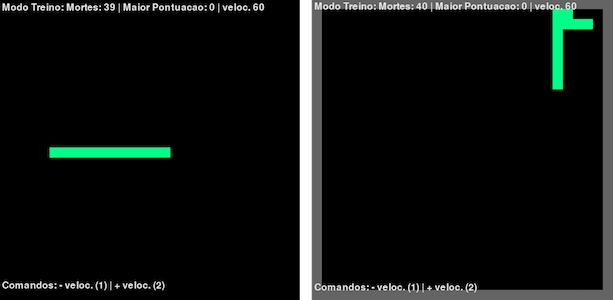

# Redes Neurais aplicado a jogos digitais
Este é o material da oficina de redes neurais aplicada a jogos digitais. Em especial, este material é dedicado a pessoas curiosas que querem iniciar carreira na área de aprendizagem de máquina. Se você já tem _expertise_ na área, sinto lhe informar que este material não apresenta métodos avançados, apenas implementação de conceitos básicos em projetos divertidos  =). Se você é professor, fique a vontade para usar este material em suas aulas, mas cite a referência ;)

Vale ressaltar que o ideal é obter este material após assistir minha aula sobre fundamentos de aprendizagem de máquina e redes neurais. De qualquer forma, meus _slides_ estão na pasta "slide" que esta na raiz deste repositório.

### Dependências
Este material foi desenvolvido com a linguagem Python versão 3.6.5. Para executar os projetos é necessário instalar as seguintes dependências:

  * PyGame versão 1.9.4
  * TensorFlow versão 1.8
  * Numpy versão 1.14

Você pode testar outras versões dos pacotes, mas caso ocorra algum erro, use as versões listadas acima.

## Projeto 1 - NN Snake

O primeiro projeto da oficina é um _snake_ (vulgo jogo da cobrinha). O objetivo do jogo é guiar a cobra para comer os alimentos que aparecem aletoriamente no mapa. Ao comer, a cobra cresce, o que torna jogo mais dificil, pois o jogador deve tomar cuidado para não morder a própria cauda.

Desenvolvi uma _engine_ para o jogo snake que permite a edição dos componentes chaves relacionados a aprendizagem de máquina. Dessa forma você não precisa se preocupar com questões de controle e desenho do jogo. Para rodar o jogo vá para a raiz do repositório e execute: 
```
python3 snake/main.py
```

### Modo Treinamento

Primeiro você deve entender como realizar o treinamento da cobra para que ela aprenda as mecânicas básicas do jogo. No decorrer desta seção, primeiro explico como modelar uma rede neural para ensinar a cobra a sobreviver desviando dos obstáculos. Em seguida, explico como modelar outra rede neural para ensinar a cobra a buscar por comida.

No inicio do documento "snake/main.py" existe uma variável chamada _CONST_TRAIN_MODE_ que determina se o jogo deve executar em modo de treinamento. Deixe a variavél com valor _True_, como abaixo:

```
CONST_TRAIN_MODE = True
```

#### Aprendendo a sobreviver

Nessa tarefa a cobra deve aprender a sobreviver no mapa. Para isso, ela deve aprender a desviar dos obstáculos. Os obstáculos do mapa podem ser uma parte do seu próprio corpo ou uma parede. A arquitetura padrão usada para aprender esta tarefa consiste de uma rede neural do tipo MLP com 2 camadas escondidas. A camada de entrada contém 4 atributos, os 3 primeiros _(x1,x2 e x_3)_ respectivamente recebem 1 se existe um obstáculo a esquerda, frente e direita da cobra, e 0 caso contrário; O atributo _x4_ indica qual a decisão de movimento da cobra, -1 para esquerda, 0 para frente e 1 para direita. A saída da rede prediz o estado da cobra, 0 para morta, e 1 para viva. A primeira e segunda camadas escondidas possuem 4 e 2 neurônios, respectivamente. A Figura abaixo ilsutra a arquitetura da rede neural. 

<p align="center">
  
</p>

Antes de executar o jogo verifique se a variável _CONST_BOT_MODE_ está com o valor "_survive_" (como abaixo). Neste modo a cobra gera apenas os dados para a rede e interpreta sua saída apenas para tomar decisões de sobrevivência. Durante a execução do jogo, são gerados 3 _arrays_ de 4 dimensões, cada array contém uma decisão de movimento (-1/0/1) e os sensores de obstáculos em relação a cabeça da cobra. O _label_ corresponde a 3 _arrays_ de 1 dimensão, indicando o estado de vida da cobra para cada decisão de movimento, 1 para viva e 0 para morta. A saída da rede é usada para a tomada de decisão, a maior ativação dentre as 3 saídas é usada para indicar qual movimento deve ser feito, por exemplo: dada a saída [0.9, 0.5, 0.3] a cobra deve ir para a esquerda, pois o valor da primeira posição corresponde ao _array_ de entrada do movimento esquerda.

```
CONST_BOT_MODE = "survive"
```

Ao executar o jogo a cobra morre com bastante frequência, isso acorre basicamente por que a cobra acaba mordendo seu próprio corpo. Sempre que a cobra morre o jogo é reiniciado. Após morrer 35 vezes a cobra começa a desviar do seu próprio corpo até que ela "entende" que a melhor decisão para esse caso é andar em linha reta. 


<p align="center">
  
</p>

#### Aprendendo a procurar comida

Nesta atividade é adicionado um novo atributo na rede para também dar capacidade de procurar por comida. Além dos 4 atributos especificados na atividade anterior, agora o novo atributo ($x_5$) indica em que direção a comida esta em relação a cobra, -1 se a comida está a esquerda da cobra, 0 na frente e 1 a direita. Também foi adicionado um novo neurônio na camada de saída que prediz se a cobra está caminhando na direção da comida, 1 para sim e 0 para não. 

<p align="center">
  
</p>

### Modo Play

